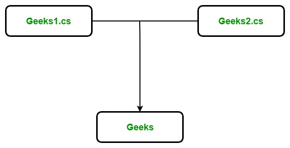

## 12. PARTIAL CLASS

# 

A partial class is a special feature of C#. It provides a special ability to implement the functionality of a single class into multiple files and all these files are combined into a single class file when the application is compiled. A partial class is created by using a ***partial\*** keyword. This keyword is also useful to split the functionality of methods, interfaces, or structure into multiple files.

**Syntax :**

```
public partial Clas_name  
{
        // code
}
```

**Important points:**


- When you want to chop the functionality of the class, method, interface, or structure into multiple files, then you should use *partial* keyword and all the files are mandatory to available at compile time for creating final file.
- The *partial* modifier can only present instantly before the keywords like struct, class, and interface.
- Every part of the partial class definition should be in the same assembly and [namespace](https://www.geeksforgeeks.org/c-namespaces/), but you can use different source file name.
- Every part of the partial class definition should have the same accessibility like private, protected, etc.
- If any part of the partial class is declared as an abstract, sealed, or base, then the whole class is declared of the same type.
- The user is also allowed to use nested partial types.
- Dissimilar part may have dissimilar base types, but the final type must inherit all the base types.

**Example:** Here, we are taking a class named as *Geeks* and split the definition of Geeks class into two different files named as `Geeks1.cs`, and `Geeks2.cs` as shown below:



In *Geeks1.cs*, and *Geeks2.cs*, a partial class is created using the partial keyword and each file contains different functionality of Geeks class as shown below.

***Geeks1.cs\***

*filter_none*


*brightness_4*

```
public` `partial` `class` `Geeks { ``  ``private` `string` `Author_name; ``  ``private` `int` `Total_articles; `` ` `  ``public` `Geeks(``string` `a, ``int` `t) ``  ``{ ``    ``this``.Authour_name = a; ``    ``this``.Total_articles = t; ``  ``} ``} 
```

***Geeks2.cs\***

*filter_none*


*brightness_4*

```
public` `partial` `class` `Geeks { ``  ``public` `void` `Display() ``  ``{ ``    ``Console.WriteLine(``"Author's name is : "` `+ Author_name); ``    ``Console.WriteLine(``"Total number articles is : "` `+ Total_articles); ``  ``} ``} 
```

When we execute the above code, then compiler combines `Geeks1.cs` and `Geeks2.cs` into a single file, i.e. `Geeks `as shown below.

***Geeks\*** This class may contain the Main Method. For simplicity, here Main() method is not included.

*filter_none*


*brightness_4*

```
public` `class` `Geeks { ``  ``private` `string` `Author_name; ``  ``private` `int` `Total_articles; `` ` `  ``public` `Geeks(``string` `a, ``int` `t) ``  ``{ ``    ``this``.Authour_name = a; ``    ``this``.Total_articles = t; ``  ``} `` ` `  ``public` `void` `Display() ``  ``{ ``    ``Console.WriteLine(``"Author's name is : "` `+ Author_name); ``    ``Console.WriteLine(``"Total number articles is : "` `+ Total_articles); ``  ``} ``} 
```

**Advantages :**

- With the help of partial class multiple developers can work simultaneously on the same class in different files.
- With the help of partial class concept you can split the UI of design code and the business logic code to read and understand the code.
- When you were working with automatically generated code, the code can be added to the class without having to recreate the source file like in Visual studio.
- You can also maintain your application in an efficient manner by compressing large classes into small ones.