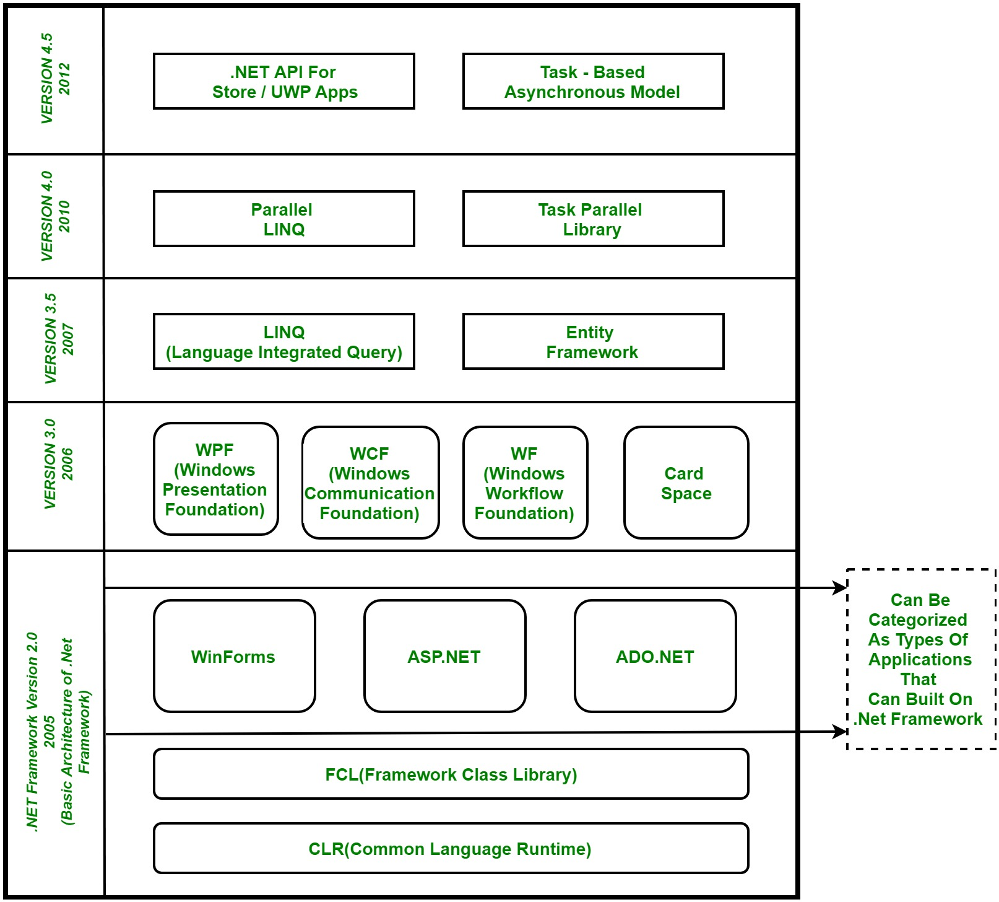

## 1. Introduction 

- .NET is a software framework which is designed and developed by Microsoft. In easy words, it is a virtual machine for compiling and executing programs written in different languages like [C#](https://www.geeksforgeeks.org/introduction-to-c/), VB.Net etc.

- It is used to develop Form-based applications, Web-based applications and Web services. There is a variety of programming languages available on the .Net platform, VB.Net and [C#](https://www.geeksforgeeks.org/introduction-to-c/) being the most common ones are . It is used to build applications for Windows, phone, web etc. It provides a lot of functionalities and also supports industry standards.

  ### **Basic Architecture and Component Stack of .NET Framework**

  

  

  

  ###### **1. CLR (Common Language Runtime) :**

  - It is a run-time environment which executes the code written in any .NET programming language. .Net framework provides the support for many languages like [C#](https://www.geeksforgeeks.org/introduction-to-c/), F#, [C++](https://www.geeksforgeeks.org/c-plus-plus/), Cobra, Jscript.Net, VB.Net, Oxygene etc.

  ######  2. FCL (Framework Class Library) :

  - A large number of class libraries are present in this framework which is known as FCL.

  ######  3. Types of Applications : #

  -  Mainly the applications which are built in .Net framework is divided into the following three categories :
    - **WinForms :** Form – Based applications are considered under this category. In simple terms, we can say client based applications which read and writes the file system comes under this category.
    - **ASP .NET :** Web-Based applications come under this category. ASP.Net is a framework for web and it provides the awesome integration of HTML, CSS and JavaScript which makes it useful to develop the web applications, websites and web services. **Web services were added in .Net Framework 2.0 and considered as a part of ASP.NET web applications.**
    - **ADO .NET :** It includes the application which are developed to communicate with the database like MS SQL Server, Oracle etc. comes. It mainly consists of classes that can be used to connect, retrieve, insert and delete data.

  ###### 4. WPF(Windows Presentation Foundation) 

  - Windows Presentation Foundation (WPF) is a graphical subsystem given by Microsoft which uses DirectX and is used in Windows-based applications for rendering UI (User Interface). WPF was initially released as part of .NET Framework 3.0 in 2006 and previously known as **“Avalon”**.

  ###### 5. WCF (Windows Communication Foundation) :

  - It is a framework for building connected and service-oriented applications used to transmit the data as asynchronous from one service endpoint to another service point. It was previously known as the **Indigo**.

  ###### 6. WF (Windows Workflow Foundation) :

  -  It is a technology given by Microsoft which provides a platform for building workflows within .Net applications.

  ###### 7. Card Space :

  -  It is a Microsoft .NET Framework software client which is designed to let users provide their digital identity to online services in a secure, simple and trusted way.

  ###### 8. LINQ (Language Integrated Query) :

  - It is introduced in .Net framework version 3.5. Basically, it is a query language used to make the query for data sources with VB or [C#](https://www.geeksforgeeks.org/introduction-to-c/) programming languages.

  ###### 9. Entity Framework :

  - It is open–source ORM (Object Relational Mapping) based framework which comes into .Net Framework version 3.5. It enables the .Net developer to work with database using .Net objects. Before entity framework, .Net developers have performed a lot of things related database. Like to open a connection to the database, developers have to create a Data Set to fetch or submit the data to the database, convert data from the Data Set to .NET objects or vice-versa. It creates the difficulties for developers and also it was the error-prone process, then **“Entity Framework”** comes to automate all these database related activities for the application. So, Entity Framework allows the developers to work at a higher level of abstraction.

    > [NOTE]() : **REST (Representational State Transfer) ** and **AJAX** were added in .Net Framework 3.5 as an extension and services of ASP.NET for enhancing web services of .NET Framework. 

  

  ###### 10. Parallel LINQ (Language Integrated Query) :

  - It comes in .Net Framework version 4.0 and also termed as PLINQ. It provides a concurrent query execution engine for **LINQ**. It executes the **LINQ** in parallel such that it tries to use as much processing power system on which it is executing.

  ###### 11. TPL (Task Parallel Library) :

  - It is a set of public types and APIs. It allows the developers to be more productive by simplifying the process of adding concurrency and parallelism to .Net applications.

  ###### 12. .NET API For Store/UWP Apps :

  - In 2012, Microsoft added some APIs for creating **UWP(Universal Windows Platform)** apps for Windows using [C#](https://www.geeksforgeeks.org/introduction-to-c/) or VB.

  ###### 13. Task-Based Asynchronous Model :

  -  It is model used to describe the asynchronous operations and tasks in .Net Framework.

