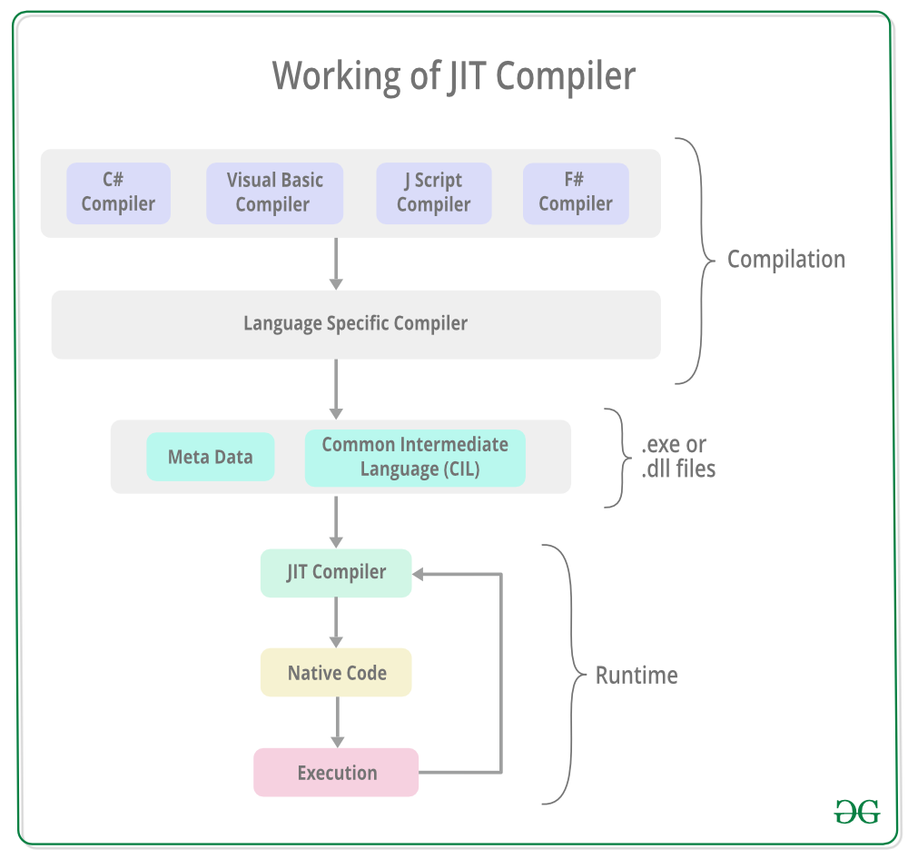

## 3. JUST IN TIME COMPILER

- Just-In-Time compiler(JIT) is a part of **[Common Language Runtime (CLR)](https://www.geeksforgeeks.org/common-language-runtime-clr-in-c-sharp/)** in *.NET* which is responsible for managing the execution of *.NET* programs regardless of any *.NET* programming language. 
- A language-specific compiler converts the source code to the intermediate language. This intermediate language is then converted into the machine code by the Just-In-Time (JIT) compiler. This machine code is specific to the computer environment that the JIT compiler runs on.

**Working of JIT Compiler:** The JIT compiler is required to speed up the code execution and provide support for multiple platforms. Its working is given as follows:

- The JIT compiler converts the Microsoft Intermediate Language(MSIL) or Common Intermediate Language(CIL) into the machine code. This is done before the MSIL or CIL can be executed. 

- The MSIL is converted into machine code on a requirement basis i.e. the JIT compiler compiles the MSIL or CIL as required rather than the whole of it. The compiled MSIL or CIL is stored so that it is available for subsequent calls if required.

  ### Advantages of JIT Compiler:

  - The JIT compiler requires less memory usage as only the methods that are required at run-time are compiled into machine code by the JIT Compiler.
  - Page faults are reduced by using the JIT compiler as the methods required together are most probably in the same memory page.
  - Code optimization based on statistical analysis can be performed by the JIT compiler while the code is running.

  ### Disadvantages of JIT compiler:

  - The JIT compiler requires more startup time while the application is executed initially.
  - The cache memory is heavily used by the JIT compiler to store the source code methods that are required at run-time.