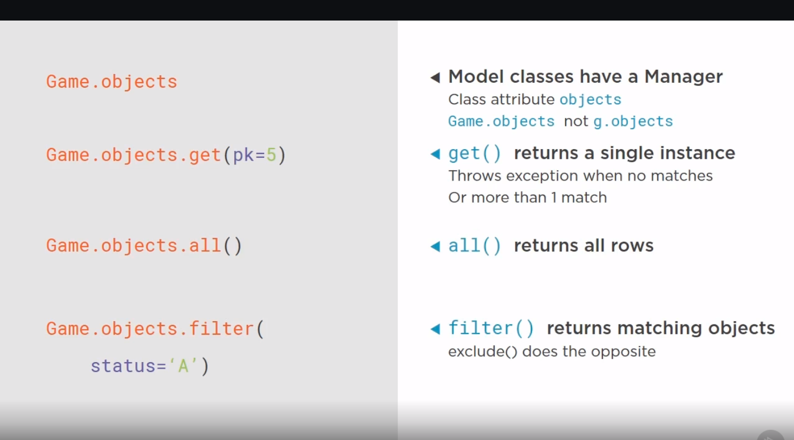

python manage.py showmigrations

python manage.py migrate

python mange.py makemigrations --- create migration script

python manage.py sqlmigrate gameplay 0001

python mange.py startapp gameplay

python manage.py createsuperuser

In python3 all strings are unicode

python manage.py shell

